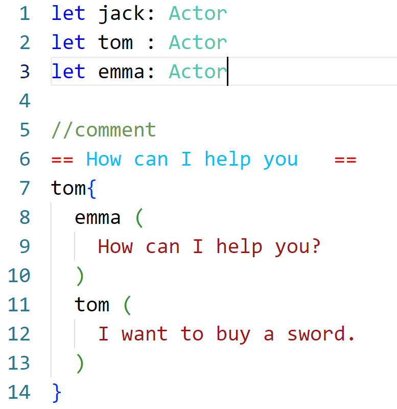
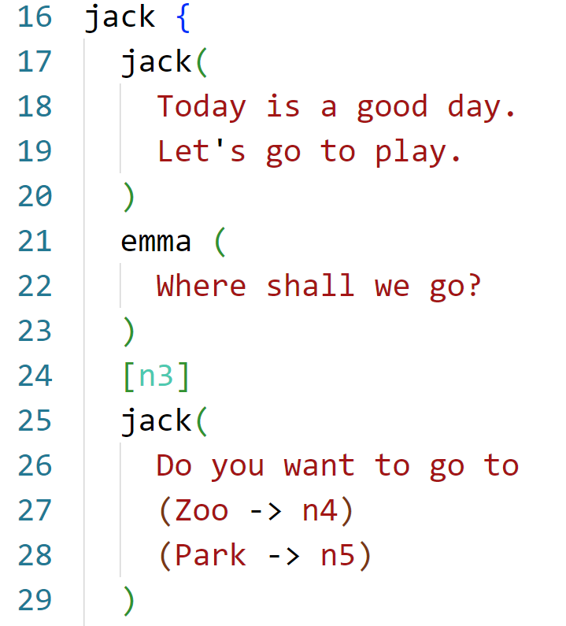

# dialogo README

This is a domain-specific language designed for game dialog systems. It is much simpler than Ink. This extension supports syntax highlighting and folder organization. Additionally, there is a C# parser for this language and a Unity plugin, though these are not included in this extension. This extension is intended solely for editing purposes.

## Instruction for use

Create a file with the ".dlg" extension, and it will work.

## Features

## Release Notes

### 1.0.0

Initial release of dialogo

### 2.0.1

V2.0 , grammar updated
